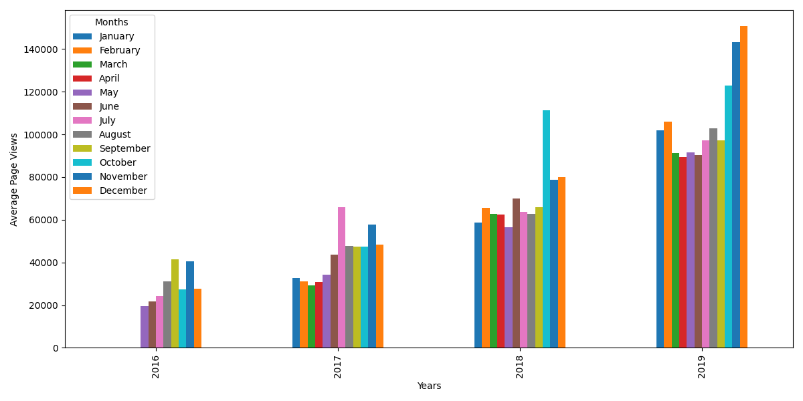
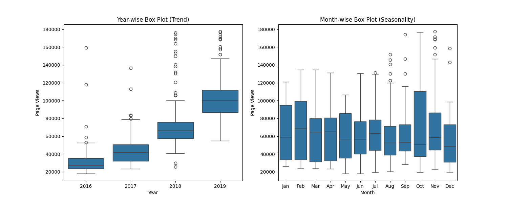

# Page View Time Series Visualizer
**freeCodeCamp – Data Analysis with Python Certification | Project 4 of 5**

## Project Overview
Visualized **daily freeCodeCamp forum page views (2016–2019)** using **Matplotlib** and **Seaborn**:
- Line chart showing daily trends
- Bar chart of monthly averages
- Box plots revealing yearly trends and seasonality

## Visualizations

### Daily Page Views (2016–2019)

### Average Daily Views by Month

### Distribution & Seasonality

## Key Insights
- Strong upward trend from 2016–2019
- Clear seasonal pattern (peaks in fall, dips in summer)
- 2018–2019 saw the highest traffic

## Live Notebook
[Run & Explore on Google Colab](https://colab.research.google.com/drive/1VOm87C-8d_8igaITeC_3-92CFNnHxNeC?usp=sharing)

## Files
- `page_view_time_series_visualizer.ipynb`
- `fcc-forum-pageviews.csv`
- Three saved plots

## Skills Demonstrated
- Time series data handling
- Outlier removal using quantiles
- Advanced Matplotlib/Seaborn plotting
- Professional visualization styling

---

## Connect with Me

**Made with love by Abishek**

**4/5 PRoject 5 – Sea Level Predictor** (with linear regression)?  
Just say **“Let’s finish with Project 5”** and we’ll complete the entire certification in style!
